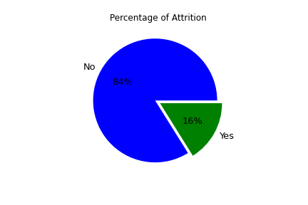
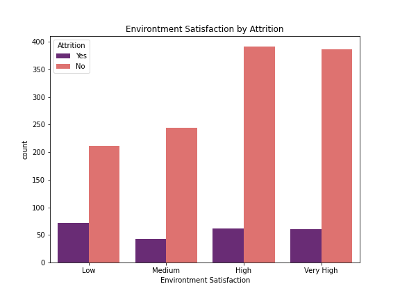
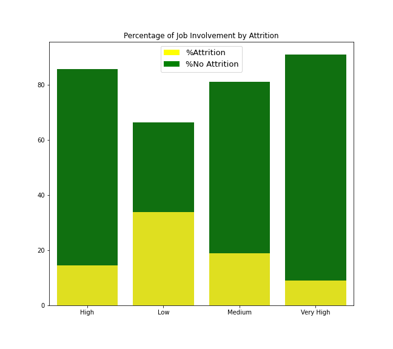
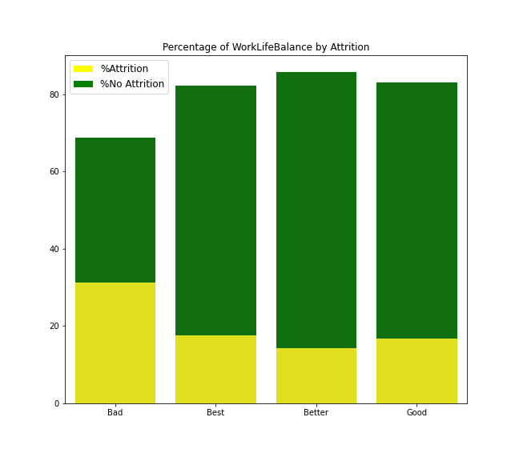
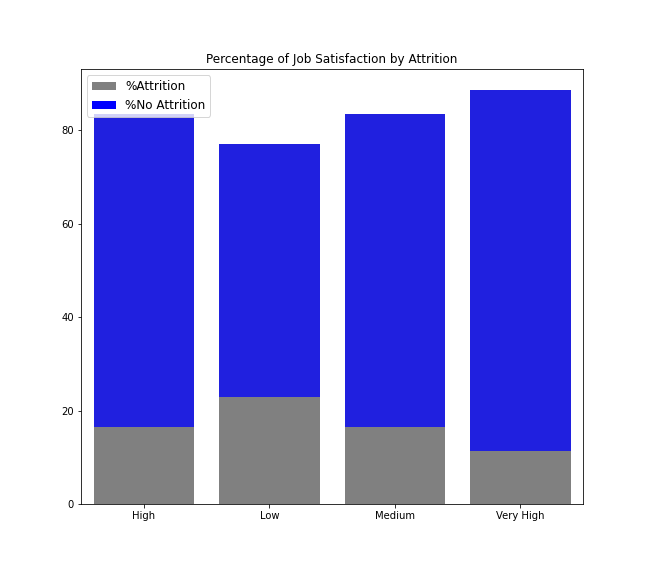

# EXPLORATORY_DATA_ANALYST_EMPLOYEE
This is My Exploratory Data Analyst that I did on Employee Dataset to find out the reason behind of Attrition.

### ABOUT DATASET
The Dataset that I use was Employee Dataset. This Dataset contains 35 features with some categorical and numeric features. The target from this dataset is 'Attrition' which consists of 'Yes' and 'No' categorical. 'Yes' means that employee leave the workforce while 'No' means that employee didn't leave the workplace. I will focusing to know what's the reason behind of the Attrition.

### BACKGROUND
Employee attrition is defined as the natural process by which employees leave the workforce – for example, through resignation for personal reasons or retirement – and are not immediately replaced. 
In 2018 a staggering 41.4 million U.S. workers voluntarily left their jobs. Nationally, employee voluntary turnover exceeded 27%. If this trend to continue, U.S. voluntary turnover will hit 35% by 2023, placing companies in continuous and enormous risk. 

source:\
https://www.toolbox.com/hr/engagement-retention/articles/what-is-attrition-complete-guide/ \
http://info.workinstitute.com/retentionreport2019

### PROBLEM
From the background above, company will having problems such as:
- **Reduced size of workforce**\
    This is could be problems when taking on the tasks because of small employee. Also will increase the workload volume for the remaining employees.
- **Potential to be costly**\
    Attrition due to job elimination could present problems when its come to unexpected event such as the death of an employee. Cost and risk will present itself

source:\
https://sprigghr.com/blog/hr-professionals/employee-attrition-vs-employee-turnover/

### GOAL
So, the goals from this exploratory Data Analysis is to find the reason behind employees attrition to helps company reduce human capital expense.

**Here are some insight that I got from this EDA:**

`1. Attrition`\
This Target column show imbalance data with 16% having Attrition while the rest around 83% employees not leave the workplace.
##### Attrition

`2. Environtment Satisfaction Features`\
This features classified into Low, Medium, High and Very High. In here, I tried to find out what Environmental Satisfaction category has the highest Attrition. As showed below, Low Environmental Satisfaction has the highest Attrition compare to other category.
##### Envirotment Satisfaction

In futher analysis, I found out that Low environtment Satisfaction comes from Bachelor Education especially Life Science Field. More, Low environtment Satisfaction also comes from employees from Single Status. For more explanation, please check on my ipynb file.

`3. Job Involvement `\
This features classified into Low, Medium, High and Very High. From this features, I tried to find out if Low Job Involvment could be reason behind of Attrition. Here are the visualize :
##### Job Involvement

From the stacked bar, Low JobInvolvement have the highest percentage of attrition with 33.73% while Very High JobInvolvement has the smallest percentage (9.03%). This is assume that employees who have Low JobInvolvement prefer to leave the workforce.

`4. Work Life Balance`\
This features classified into Better, Good, Best and Bad. I tried to visualize this feature by Attrition using stacked bar and got this results:
##### Work Life Balance

As we show from the stacked bar, Work Life Balance with Bad category has the highest percentage of Attrition around 31.35%. So, this could be a concern to employees who have Bad category. In futher analyst, I tried to find out what causes employees that have Bad category of Work Life Balance. So, it turn out that employees who have Bad WorkLifeBalance could be caused by Low JobInvolvment because it has the highest attrition around 75% from Low JobInvolvment. Also it turn out that employees who has Bad WorkLifeBalance comes from Travel_Frequently with percentage around 46.15%. More when I tried to explore for WorkLifeBalance by OverTime feature, it turn out that employee who have Bad category of WorkLifeBalance mostly did OverTime work with percentage 45.45%.

`5. Job Satisfaction`\
This feature classified into Low, Medium, High and Very High. Here is the visualize using stacked bar to know what category of JobSatisfaction that have the highest Attrition.
##### Job Satisfaction

The graph show that Low JobSatisfaction has the highest percentage of Attrition around 22.84%. This one could also become the reason behind of employees leave their job.

### Conclusion
Here are some conclusion that should become concern on what reason behind of Attrition :
- Employees who have **Low Environtment Satisfaction** tend to leave from workplace. The percentage reach 25.35%
- Employees who have **Low Job Involvement** tend to leave from workplace. The percentage of Attrition reach 33.73% while employees with Very High Job Involvement has the smallest percentage of Attrition around 9.03%
- Employees who have **Bad WorkLifeBalance** tend to leave from workplace. Bad WorkLifeBalance could be caused by low JobInvolvement, having Travel_Frequently and OverWork
- Employees who have **Low Job Satisfaction** tend to leave from workplace. The percentage of Attrition reach 22.84%

### Suggestion
Here are some suggestion to reduce Attrition:
- Since mostly Attrition comes from Low Environtment Satisfaction, Employers should improve the work environtment including culture-fit, facilities, safety.
- Low Job Involvement could effect on employee performance. So to improve employee who have Low JobInvolvement, Employers could adding more Training Times about the job itself or training that could gain motivated for employee
- Since Employees who have Bad WorkLifeBalance could be caused by having Travel Frequently and OverWork, so the employers should re-scheduling for the employees or even making policies that fit-well to employees
- To prevent Low Job Satisfaction of employees, Employers should be better when hiring or placing minimum experience >2 years for every JobRole especially Laboratory Technician and show clearly job previews for the job seeker so it could prevent misconception of what will the employee do.

For more EDA regarding Attrition, please kindly check on my ipynb file. I also tried explore another features and find another insight there...\
Thank you!
:)

